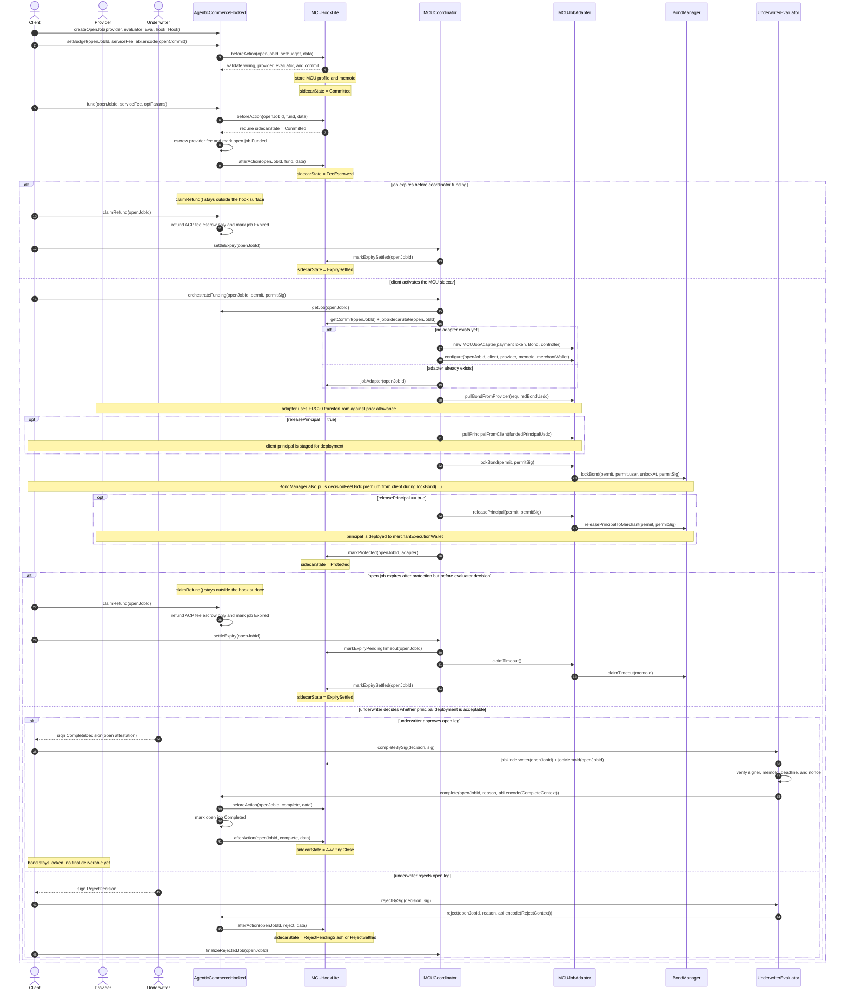
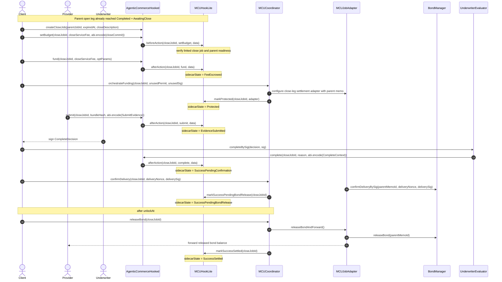

# MCU Hook System

This directory contains an experimental ACP-compatible hook profile for Merchant
Custody Underwriting (MCU).

The design keeps `AgenticCommerceHooked` as the standard job kernel and moves
MCU-specific policy, bond, principal, and underwriting flows into a separate
module. The goal is to preserve ACP's small, predictable escrow lifecycle while
still supporting bond-backed merchant execution and underwriter-signed
finalization.

## Design Summary

The MCU module follows a "light hook + explicit coordinator" model:

- ACP core escrows only the provider service fee.
- `MCUHookLite` stores MCU configuration and gates ACP transitions.
- `MCUCoordinator` performs the heavy sidecar steps after ACP transitions.
- `MCUJobAdapter` bridges caller-shape assumptions when interacting with
  `BondManager`.
- `UnderwriterEvaluator` verifies underwriter signatures and acts as the ACP
  evaluator contract, including post-timeout success dispute decisions.

This split intentionally avoids packing every bond and principal side effect
into ACP hook callbacks. That keeps the hook smaller, fits better with
`AgenticCommerceHooked`'s gas-limited callback model, and leaves `claimRefund()`
outside the hook surface as intended by ACP.

## Module Layout

| File | Responsibility |
|------|----------------|
| `IAgenticCommerceKernel.sol` | Local interface for the hookable ACP kernel used by this module. |
| `IBondManager.sol` | Sidecar settlement interface for bond, principal, timeout, and slash flows. |
| `MCUTypes.sol` | Shared enums and payload structs used across the MCU contracts, including success-dispute decisions. |
| `MCUHookLite.sol` | Policy hook that commits profile metadata, gates ACP actions, and tracks MCU sidecar state and delivery-confirmation deadlines. |
| `MCUCoordinator.sol` | Explicit orchestrator for funding, delivery confirmation, post-timeout success disputes, bond release, timeout handling, and reject cleanup. |
| `MCUJobAdapter.sol` | Per-job adapter that pulls funds and presents the sender shape expected by `BondManager`. |
| `UnderwriterEvaluator.sol` | Contract evaluator that verifies underwriter EIP-712 decisions for ACP `complete()` / `reject()` and success-dispute resolution. |

## How It Fits ACP

ACP remains the job rail:

- `createOpenJob()` creates the parent open-phase job and stores the optional hook.
- `createCloseJob()` can later create a linked close-phase job after the parent open job is completed.
- `setBudget()` commits the MCU profile.
- `fund()` escrows the provider fee in ACP.
- `submit()` records the evidence bundle for evaluator review on close legs (and
  on any standalone flows that still use submission).
- `complete()` / `reject()` are still evaluator-driven terminal decisions.
- `claimRefund()` remains non-hookable and refunds only the ACP escrow.

The MCU module handles the non-core settlement legs:

- underwriting premium
- merchant bond
- funded principal deployment
- delivery mirroring into `BondManager`
- delivery-confirmation timeout escalation
- bond release, slash, timeout settlement, and reject cleanup

This boundary is important: the ACP budget should represent the provider service
fee, not a merged bucket for premium, principal, bond, and compensation.

## Expected Job Flow

In the current two-phase branch, MCU is split into an **open leg** and an
optional **close leg**:

1. Open leg:
   - `createOpenJob(provider, evaluator = UnderwriterEvaluator, expiredAt, description, hook = MCUHookLite)`
   - `setBudget(openJobId, serviceFee, abi.encode(MCUTypes.MCUCommit))`
   - `fund(openJobId, serviceFee, optParams)`
   - `MCUCoordinator.orchestrateFunding(openJobId, permit, permitSig)`
   - `UnderwriterEvaluator.completeBySig(...)` or `rejectBySig(...)` while the
     open job is still ACP `Funded`
   - on success, `MCUHookLite` marks the parent sidecar `AwaitingClose`

2. Close leg:
   - when the client actually wants to unwind or settle, it calls
     `createCloseJob(parentJobId, expiredAt, description)`
   - `setBudget(closeJobId, closeServiceFee, abi.encode(closeCommit))`
   - `fund(closeJobId, closeServiceFee, optParams)`
   - `MCUCoordinator.orchestrateFunding(closeJobId, ...)` binds a settlement
     adapter to the parent memo but does **not** pull a new bond or principal
   - `submit(closeJobId, bundleHash, abi.encode(MCUTypes.SubmitEvidence))`
   - `UnderwriterEvaluator.completeBySig(...)` or `rejectBySig(...)`
   - success / dispute / slash on the close leg determines whether the **parent
     open-leg bond** is released or slashed
   - if a close attempt reaches ACP `Rejected` or `Expired`, the parent open leg
     stays `AwaitingClose` and the client can submit a replacement close job

3. Failure / expiry paths:
   - reject cleanup via `MCUCoordinator.finalizeRejectedJob(...)`
   - timeout cleanup via `MCUCoordinator.settleExpiry(...)`

Important semantic note:

- `principal` is client capital handed to the provider for strategy execution.
- The current `BondManager` method name `releasePrincipalToMerchant(...)` is used
  during the **open leg**, but semantically this is principal **deployment** to
  `merchantExecutionWallet`, not final settlement.
- The actual user-facing `deliverable` is only submitted on the **close leg**.

## Sequence Diagram

### Open Leg

The open leg deploys client principal into the provider execution wallet under
underwriter protection. It does **not** submit the final deliverable and does
**not** release the merchant bond.

### Close Leg Settlement Path

The close leg is where the final deliverable is submitted and where the parent
open-leg bond is ultimately released or slashed.

## Sidecar State Model

`MCUTypes.SidecarState` tracks the MCU-specific phase for each job independently
from ACP's core job status:

- `Committed`: MCU profile stored at `setBudget()`
- `FeeEscrowed`: ACP service fee funded, sidecar not yet activated
- `Protected`: bond locked and principal deployed if configured
- `AwaitingClose`: open leg completed; principal deployment accepted and the
  parent leg can now spawn a linked close job
- `EvidenceSubmitted`: evidence bundle accepted after protection
- `SuccessPendingConfirmation`: close job completed, sidecar success still needs
  delivery confirmation or timeout-based merchant escalation
- `SuccessDisputeOpen`: the delivery-confirmation timeout has expired, the
  merchant opened a dispute, and the underwriter has not yet resolved it
- `SuccessPendingBondRelease`: delivery was confirmed or the dispute was
  resolved in favor of releasing the merchant bond, and the job is waiting for
  `unlockAt`
- `SuccessSlashed`: the post-timeout success dispute resolved against the
  merchant and the bond slash was applied
- `RejectPendingSlash`: ACP rejected after protection, reject-side settlement
  still outstanding
- `ExpiryPendingTimeout`: ACP expired, timeout-side settlement still
  outstanding

This keeps ACP status and MCU status separate: ACP says whether the job is open,
funded, submitted, completed, rejected, or expired, while the MCU sidecar state
tracks whether underwriting settlement work is still outstanding. For two-phase
flows, the open leg parks in `AwaitingClose`, while the close leg is the only
leg that can advance into the final bond release/slash states.

## Why the Coordinator Exists

The coordinator is the key architectural choice in this module.

Instead of performing all side effects inside ACP hook callbacks, the hook is
kept focused on validation and state commitments, while the coordinator handles
the expensive or sidecar-specific steps explicitly. This has a few benefits:

- it avoids heavy external calls inside hook callbacks
- it makes the funding and settlement steps easier to test directly
- it keeps timeout handling compatible with ACP's non-hookable `claimRefund()`
- it isolates `BondManager`-specific assumptions behind the adapter

This is especially useful while the sidecar surface is still evolving.

## Current Status

This module is currently a prototype and should be treated as experimental.

- The adapter's token movement and `BondManager` plumbing are wired.
- The success path now includes a delivery-confirmation timeout and an
  underwriter-signed success dispute lane that can release or slash the
  merchant bond.
- `MCUCoordinator.orchestrateFunding()` has lean integration coverage with mock
  ACP and hook dependencies.
- The module builds cleanly with `forge build --contracts contracts/mcu`.
- The focused MCU tests pass with `forge test --match-path "test/mcu/*.t.sol" --contracts contracts/mcu`.

Some parts are still intentionally lightweight:

- broader end-to-end ACP integration is not fully covered yet
- reject, expiry, and slash settlement semantics still depend on the final
  `BondManager` rules
- the module currently favors clarity and separable responsibilities over full
  atomic settlement

In terms of `hook-profiles.md`, this implementation is closest to an
experimental Profile C hook system today, with a path toward a cleaner advanced
settlement profile as the sidecar surface hardens.

## Notes for Integrators

- Use `AgenticCommerceHooked`, not the plain `AgenticCommerce` contract, when
  integrating this module.
- In this README, `client` and `user` refer to the same end-user identity.
- In MCU terminology, ACP `provider` is the merchant counterparty that posts
  the bond.
- `MCUHookLite` implements `IACPHook` directly rather than using
  `BaseACPHook`. This avoids coupling to helper logic while the MCU module is
  still stabilizing.
- Treat the ACP evaluator as the `UnderwriterEvaluator` contract, not the raw
  underwriter EOA.
- Set `MCUTypes.MCUCommit.deliveryConfirmationTimeoutWindow` to the maximum time
  the client has to confirm delivery before the merchant can open a success
  dispute.
- Keep ACP fee escrow and MCU settlement amounts separate in off-chain clients
  and UI flows.
