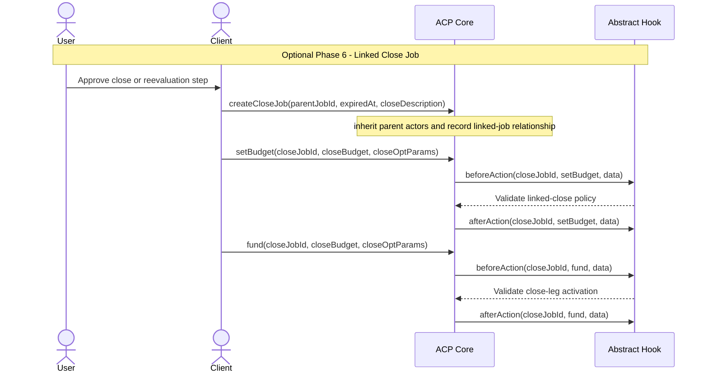

# Abstract ERC-ACP Sequence Diagram

This document captures the generic ERC-ACP request, negotiation, transaction,
and completion flow with an abstract hook. It intentionally does not assume any
specific hook implementation.

```mermaid
sequenceDiagram
    autonumber
    actor User
    actor Client
    actor Provider
    participant ACP as ACP Core
    participant Hook as Abstract Hook

    Note over User,Hook: Phase 0 - Discovery
    User->>Client: Describe intent and constraints
    Client->>Provider: Request service or resource options
    Provider-->>Client: Return quoted option(s)
    Client-->>User: Present recommended option

    Note over User,Hook: Phase 1 - Request
    User->>Client: Approve selected option
    Client->>ACP: initiateJob() / createJob(...) / createOpenJob(...)
    Note over Client,ACP: Client creates the JobRequestMemo
    Client->>ACP: setBudget(...) / commit requirements and budget
    ACP->>Hook: beforeAction(jobId, setBudget, data)
    Hook-->>ACP: Validate and store hook-specific policy state
    ACP->>Hook: afterAction(jobId, setBudget, data)

    Note over User,Hook: Phase 2 - Negotiation
    Provider->>ACP: memoToSign(jobId) / read JobRequestMemo
    ACP-->>Provider: Return JobRequestMemo payload or digest
    Provider->>ACP: Sign JobRequestMemo
    Note over Provider,ACP: Provider signs the client-authored request memo
    Provider->>ACP: Create or publish PayableRequestMemo
    Note over Provider,ACP: Provider creates the payable memo with amount, token, settlement terms, and deadline

    Note over User,Hook: Phase 3 - Transaction
    Client->>ACP: Create TransactionMemo
    Client->>ACP: Sign PayableRequestMemo
    Note over Client,ACP: Client signs the provider-authored payable memo
    Client->>ACP: payAndAcceptRequirements() / fund(...)
    ACP->>Hook: beforeAction(jobId, fund, data)
    Hook-->>ACP: Validate funding and acceptance policy
    ACP->>Hook: afterAction(jobId, fund, data)
    ACP-->>Provider: Funding confirmed; job becomes executable

    Provider->>Provider: Execute agreed service
    Provider->>ACP: submit(jobId, deliverable, data)
    ACP->>Hook: beforeAction(jobId, submit, data)
    Hook-->>ACP: Validate submission policy
    ACP->>Hook: afterAction(jobId, submit, data)

    Note over User,Hook: Phase 4 / 5 - Evaluation and Completion
    Note over ACP,Hook: Optional external evaluation may occur before completion
    ACP->>Hook: beforeAction(jobId, complete, data)
    Hook-->>ACP: Validate completion policy
    ACP-->>Provider: Release net payment
    ACP->>Hook: afterAction(jobId, complete, data)
    ACP-->>Client: Mark job completed

    Note over User,Hook: Post Completion
    Provider->>ACP: sendNotificationMemo(...) optional
    ACP-->>Client: Relay status or update
    Client-->>User: Present update
    User->>Client: Request latest position or resource state
    Client->>Provider: Query latest state
    Provider-->>Client: Return latest state
    Client-->>User: Present latest state
```

## Optional Linked Close Job Extension

Implementations that adopt ACP linked two-phase jobs can start a later close or
evaluation leg after the parent open leg is completed. ACP owns the parent/close
relationship; the hook still decides any additional close-leg policy checks.



## Memo Ownership Summary

- `JobRequestMemo` is created by the `Client` and signed by the `Provider`.
- `PayableRequestMemo` is created by the `Provider` and signed by the `Client`.
- `TransactionMemo` is created by the `Client`.
- The `Abstract Hook` validates ACP lifecycle actions but does not author or sign
  the business memos.
