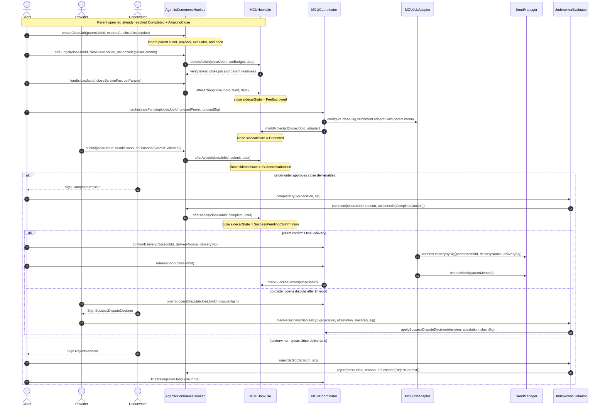

# MCU Hook System Sequence Diagram

This document mirrors the abstract ERC-ACP sequence, but replaces the generic
hook with the concrete MCU hook system used in this repository:
`AgenticCommerceHooked`, `MCUHookLite`, `MCUCoordinator`,
`MCUJobAdapter`, `BondManager`, and `UnderwriterEvaluator`.
In this MCU flow, the end user and the ACP client are the same identity, so the
diagram uses a single `Client` actor.

## Open Leg

```mermaid
sequenceDiagram
    autonumber
    actor Client
    actor Provider
    actor Underwriter
    participant ACP as AgenticCommerceHooked
    participant Hook as MCUHookLite
    participant Coord as MCUCoordinator
    participant Adapter as MCUJobAdapter
    participant Bond as BondManager
    participant Eval as UnderwriterEvaluator

    Note over Client,Eval: Phase 0 - Discovery
    Client->>Provider: Request quote and execution terms
    Provider-->>Client: Return quote and settlement terms

    Note over Client,Eval: Phase 1 - Open Request
    Client->>ACP: createOpenJob(provider, evaluator=Eval, hook=Hook)
    Client->>ACP: setBudget(openJobId, serviceFee, abi.encode(openCommit))
    ACP->>Hook: beforeAction(openJobId, setBudget, data)
    Note over Hook: sidecarState = Committed

    Note over Client,Eval: Phase 2 - Funding and Protection
    Client->>ACP: fund(openJobId, serviceFee, optParams)
    ACP->>Hook: afterAction(openJobId, fund, data)
    Note over Hook: sidecarState = FeeEscrowed

    Client->>Coord: orchestrateFunding(openJobId, permit, permitSig)
    Coord->>Adapter: pullBondFromProvider(requiredBondUsdc)
    Coord->>Adapter: pullPrincipalFromClient(fundedPrincipalUsdc)
    Adapter->>Bond: lockBond(permit, permit.user, unlockAt, permitSig)
    Adapter->>Bond: releasePrincipalToMerchant(permit, permitSig)
    Coord->>Hook: markProtected(openJobId, adapter)
    Note over Hook: sidecarState = Protected
    Note over Provider,Bond: principal is deployed to merchantExecutionWallet

    Note over Client,Eval: Phase 3 - Open Completion
    Underwriter-->>Client: Sign CompleteDecision(open attestation)
    Client->>Eval: completeBySig(decision, sig)
    Eval->>ACP: complete(openJobId, reason, abi.encode(CompleteContext))
    ACP->>Hook: afterAction(openJobId, complete, data)
    Note over Hook: sidecarState = AwaitingClose
    Note over Client,Provider: bond remains locked; no final deliverable yet
```

## Linked Close Job Extension



## Memo and Signature Summary

- `JobRequestMemo` is created by the `Client` and signed by the `Provider`.
- `PayableRequestMemo` is created by the `Provider` and signed by the `Client`.
- `MCUCommit` is committed on-chain by the `Client` during `setBudget(...)`.
- `UnderwritePermit` and `permitSig` are used by `MCUCoordinator`,
  `MCUJobAdapter`, and `BondManager` to lock the provider bond and optionally
  deploy principal.
- `CompleteDecision`, `RejectDecision`, and `SuccessDisputeDecision` are signed
  by the `Underwriter` and verified by `UnderwriterEvaluator`.

## Expiry Note

This sequence focuses on the main MCU request, execution, completion, reject,
and success-dispute paths. Expiry remains intentionally split across:

- `AgenticCommerceHooked.claimRefund(...)` for the ACP escrow refund.
- `MCUCoordinator.settleExpiry(...)` for MCU-specific timeout settlement after
  the ACP job is already marked expired.
