# MCU Hook System Sequence Diagram

This document mirrors the abstract ERC-ACP sequence, but replaces the generic
hook with the concrete MCU hook system used in this repository:
`AgenticCommerceHooked`, `MCUHookLite`, `MCUCoordinator`,
`MCUJobAdapter`, `BondManager`, and `UnderwriterEvaluator`.
In this MCU flow, the end user and the ACP client are the same identity, so the
diagram uses a single `Client` actor.

```mermaid
sequenceDiagram
    autonumber
    actor Client
    actor Provider
    actor Underwriter
    participant ACP as AgenticCommerceHooked
    participant Hook as MCUHookLite
    participant Coord as MCUCoordinator
    participant Adapter as MCUJobAdapter
    participant Bond as BondManager
    participant Eval as UnderwriterEvaluator

    Note over Client,Eval: Phase 0 - Discovery
    Client->>Provider: Request quote and execution terms
    Provider-->>Client: Return quote and settlement terms

    Note over Client,Eval: Phase 1 - Request
    Client->>ACP: createJob(provider, evaluator=Eval, hook=Hook)
    Note over Client,Provider: Client creates the JobRequestMemo off-chain
    Client-->>Provider: Share JobRequestMemo for review
    Client->>ACP: setBudget(jobId, serviceFee, abi.encode(MCUCommit))
    ACP->>Hook: beforeAction(jobId, setBudget, data)
    Hook-->>ACP: Validate wiring, provider, evaluator, and MCUCommit
    ACP->>Hook: afterAction(jobId, setBudget, data)
    Note over Hook: Store memoId, underwriter, policyHash
    Note over Hook: sidecarState = Committed

    Note over Client,Eval: Phase 2 - Negotiation
    Provider-->>Client: Sign JobRequestMemo
    Note over Provider,Client: Provider signs the client-authored request memo
    Provider-->>Client: Create PayableRequestMemo
    Note over Provider,Client: Provider authors the payable terms
    Underwriter-->>Client: Sign UnderwritePermit for BondManager
    Note over Underwriter,Client: Permit is bound to memoId, jobId, bond, principal, unlockAt, and policyHash

    Note over Client,Eval: Phase 3 - Transaction
    Client-->>Provider: Sign PayableRequestMemo
    Note over Client,Provider: Client accepts the provider-authored payable memo
    Client->>ACP: fund(jobId, serviceFee, optParams)
    ACP->>Hook: beforeAction(jobId, fund, data)
    Hook-->>ACP: Require sidecarState = Committed
    ACP->>Hook: afterAction(jobId, fund, data)
    Note over Hook: sidecarState = FeeEscrowed

    Client->>Coord: orchestrateFunding(jobId, permit, permitSig)
    Coord->>ACP: getJob(jobId)
    Coord->>Hook: getCommit(jobId) + jobSidecarState(jobId)
    alt adapter does not exist yet
        Coord->>Adapter: new MCUJobAdapter(paymentToken, Bond, controller)
        Coord->>Adapter: configure(jobId, client, provider, memoId, merchantExecutionWallet)
    else adapter already exists
        Coord->>Hook: jobAdapter(jobId)
    end
    Coord->>Adapter: pullBondFromProvider(requiredBondUsdc)
    opt releasePrincipal == true
        Coord->>Adapter: pullPrincipalFromClient(fundedPrincipalUsdc)
    end
    Coord->>Adapter: lockBond(permit, permitSig)
    Adapter->>Bond: lockBond(permit, permit.user, permit.unlockAt, permitSig)
    opt releasePrincipal == true
        Coord->>Adapter: releasePrincipal(permit, permitSig)
        Adapter->>Bond: releasePrincipalToMerchant(permit, permitSig)
    end
    Coord->>Hook: markProtected(jobId, adapter)
    Note over Hook: sidecarState = Protected
    ACP-->>Provider: ACP fee escrowed and MCU protection active

    Note over Client,Eval: Phase 4 - Execution and Evaluation
    Provider->>Provider: Execute service via merchantExecutionWallet
    Provider->>ACP: submit(jobId, bundleHash, abi.encode(SubmitEvidence))
    ACP->>Hook: beforeAction(jobId, submit, data)
    Hook-->>ACP: Require sidecarState = Protected
    ACP->>Hook: afterAction(jobId, submit, data)
    Note over Hook: Record evidence and set sidecarState = EvidenceSubmitted

    alt underwriter approves completion
        Underwriter-->>Client: Sign CompleteDecision
        Client->>Eval: completeBySig(decision, sig)
        Eval->>Hook: jobUnderwriter(jobId) + jobMemoId(jobId)
        Eval->>Eval: Verify signer, memoId, deadline, and nonce
        Eval->>ACP: complete(jobId, reason, abi.encode(CompleteContext))
        ACP->>Hook: beforeAction(jobId, complete, data)
        ACP->>Hook: afterAction(jobId, complete, data)
        Note over Hook: sidecarState = SuccessPendingConfirmation
        ACP-->>Provider: Release net ACP payment on complete()

        Note over Client,Eval: Phase 5 - Delivery Confirmation and Settlement
        alt client confirms before delivery-confirmation timeout
            Note over Client: Client confirms delivery in its own UI or workflow
            Client->>Coord: confirmDelivery(jobId, deliveryNonce, deliverySig)
            Coord->>Adapter: confirmDeliveryBySig(deliveryNonce, deliverySig)
            Adapter->>Bond: confirmDeliveryBySig(memoId, deliveryNonce, deliverySig)
            Coord->>Hook: markSuccessPendingBondRelease(jobId)
            Note over Hook: sidecarState = SuccessPendingBondRelease

            Note over Client,Coord: After unlockAt
            Client->>Coord: releaseBond(jobId)
            Coord->>Adapter: releaseBondAndForward()
            Adapter->>Bond: releaseBond(memoId)
            Adapter-->>Provider: Forward released bond balance
            Coord->>Hook: markSuccessSettled(jobId)
            Note over Hook: sidecarState = SuccessSettled

        else provider opens success dispute after timeout
            Provider->>Coord: openSuccessDispute(jobId, disputeHash)
            Coord->>Hook: jobDeliveryConfirmationDeadline(jobId)
            Coord->>Hook: markSuccessDisputeOpen(jobId, disputeHash)
            Note over Hook: sidecarState = SuccessDisputeOpen

            Underwriter-->>Provider: Sign SuccessDisputeDecision
            Provider->>Eval: resolveSuccessDisputeBySig(decision, attestation, slashSig, sig)
            Eval->>Hook: jobUnderwriter(jobId) + jobMemoId(jobId) + jobSidecarState(jobId)
            Eval->>Eval: Verify signer, memoId, dispute hash, deadline, and nonce
            Eval->>Coord: applySuccessDisputeDecision(decision, attestation, slashSig)

            alt dispute outcome releases bond
                Coord->>Hook: markSuccessPendingBondRelease(jobId)
                Note over Hook: sidecarState = SuccessPendingBondRelease

                Note over Provider,Coord: After unlockAt
                Provider->>Coord: releaseBond(jobId)
                Coord->>Adapter: releaseBondAndForward()
                Adapter->>Bond: releaseBond(memoId)
                Adapter-->>Provider: Forward released bond balance
                Coord->>Hook: markSuccessSettled(jobId)
                Note over Hook: sidecarState = SuccessSettled

            else dispute outcome slashes bond
                Coord->>Adapter: slashBond(attestation, slashSig)
                Adapter->>Bond: slash(attestation, slashSig)
                Coord->>Hook: markSuccessSlashed(jobId, disputeHash, slashAttestationHash)
                Note over Hook: sidecarState = SuccessSlashed
            end
        end

    else underwriter rejects
        Underwriter-->>Client: Sign RejectDecision
        Client->>Eval: rejectBySig(decision, sig)
        Eval->>Hook: jobUnderwriter(jobId) + jobMemoId(jobId)
        Eval->>Eval: Verify signer, memoId, deadline, and nonce
        Eval->>ACP: reject(jobId, reason, abi.encode(RejectContext))
        ACP->>Hook: beforeAction(jobId, reject, data)
        ACP->>Hook: afterAction(jobId, reject, data)
        Note over Hook: sidecarState = RejectPendingSlash

        Client->>Coord: finalizeRejectedJob(jobId)
        Coord->>Adapter: sweepResidualToProvider()
        Adapter-->>Provider: Return residual adapter balance
        Coord->>Hook: markRejectSettled(jobId)
        Note over Hook: sidecarState = RejectSettled
    end

    Note over Client,Eval: Post Completion
    Provider-->>Client: Optional status update or new quote
    Client->>Client: View latest position or execution state
```

## Memo and Signature Summary

- `JobRequestMemo` is created by the `Client` and signed by the `Provider`.
- `PayableRequestMemo` is created by the `Provider` and signed by the `Client`.
- `MCUCommit` is committed on-chain by the `Client` during `setBudget(...)`.
- `UnderwritePermit` and `permitSig` are used by `MCUCoordinator`,
  `MCUJobAdapter`, and `BondManager` to lock the provider bond and optionally
  release principal.
- `CompleteDecision`, `RejectDecision`, and `SuccessDisputeDecision` are signed
  by the `Underwriter` and verified by `UnderwriterEvaluator`.

## Expiry Note

This sequence focuses on the main MCU request, execution, completion, reject,
and success-dispute paths. Expiry remains intentionally split across:

- `AgenticCommerceHooked.claimRefund(...)` for the ACP escrow refund.
- `MCUCoordinator.settleExpiry(...)` for MCU-specific timeout settlement after
  the ACP job is already marked expired.
