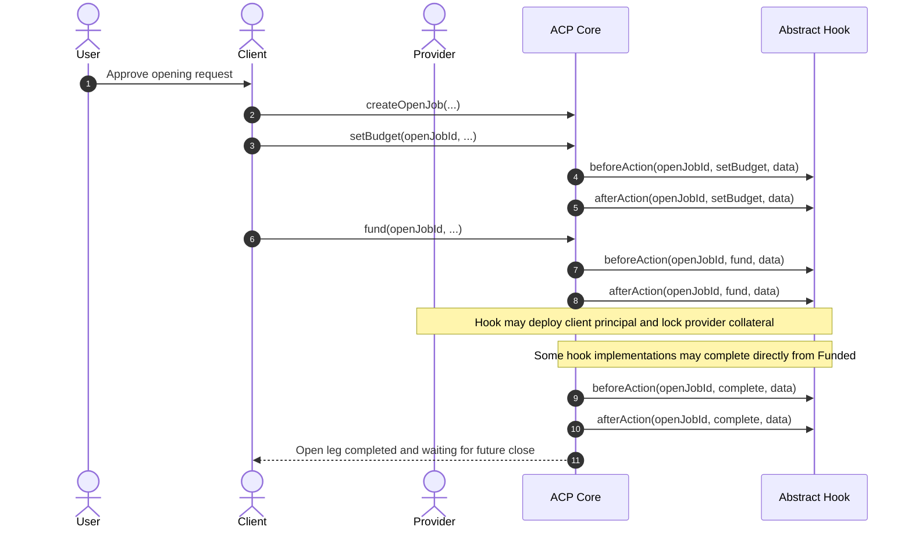
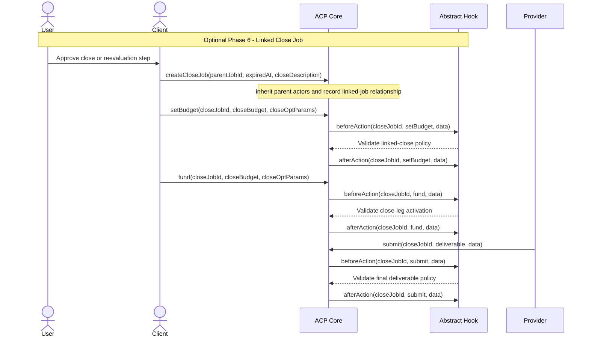

# Abstract ERC-ACP Sequence Diagram

This document captures the generic ERC-ACP request, negotiation, transaction,
and completion flow with an abstract hook. It intentionally does not assume any
specific hook implementation.

> Note: This is a generic ACP reference. The finalized underwriting flow in
> `hooks/underwriting/` requires `Submitted + EvidenceSubmitted` before
> evaluator-driven completion or rejection.

## Open Leg

## Optional Linked Close Job Extension

Implementations that adopt ACP linked two-phase jobs can start a later close or
evaluation leg after the parent open leg is completed. ACP owns the parent/close
relationship; the hook still decides any additional close-leg policy checks.

## Memo Ownership Summary

- `JobRequestMemo` is created by the `Client` and signed by the `Provider`.
- `PayableRequestMemo` is created by the `Provider` and signed by the `Client`.
- `TransactionMemo` is created by the `Client`.
- The `Abstract Hook` validates ACP lifecycle actions but does not author or sign
  the business memos.
